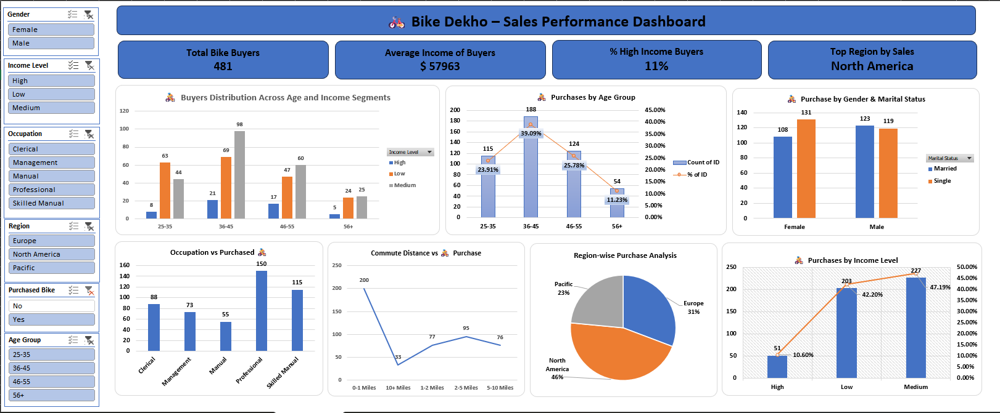

# 🚲 Bike Dekho – Sales Performance (Excel Dashboard)

This project presents a complete sales performance analysis for **Bike Dekho**, built entirely using **Microsoft Excel**. It covers the full data analytics lifecycle — from data cleaning and exploratory data analysis (EDA) to an interactive dashboard with business insights and recommendations.

---

## 📌 Objective

To analyze bike purchase behavior using customer demographics and lifestyle factors, and to build a decision-making dashboard to uncover patterns, trends, and strategic opportunities.

---

## 📊 Key Features

- ✅ Cleaned & transformed raw data using Excel functions
- ✅ Created calculated columns (Age Group, Income Level, Has Car?, etc.)
- ✅ Built 10 PivotTables for in-depth analysis
- ✅ Designed a dynamic and interactive Excel dashboard
- ✅ Derived actionable business insights with one-line summaries

---

## 📈 Dashboard Preview

---

## 🧠 Key Insights

- **Customers aged 36–45** are the most active bike buyers (39.09% of total)
- Over **89% of purchases** are from **Low and Medium income** groups
- **North America** leads in sales (46%), followed by Europe (31%)
- **69% of buyers already own a car**, suggesting bikes are used for short-distance or leisure travel
- **Professionals and Skilled Manual workers** account for 55% of total purchases

---

## 💼 Business Recommendations

- 🎯 Target **middle-income customers aged 25–45**
- 🚴 Focus marketing on **short-distance urban commuters**
- 👷 Offer **occupational discounts** to Professionals and Skilled Manual Workers
- 🌍 Expand reach in **North America**, the top-performing region
- 💡 Maintain affordability — **avoid over-targeting high-income buyers**

---

## 📁 Files Included

| File | Description |
|------|-------------|
| `Bike_Dekho_Sales_Performance_Dashboard_RonakPatel.xlsx` | Final Excel dashboard |
| `Cleaned Dataset.xlsx` | Cleaned & processed dataset used for analysis |
| `Bike Dekho – Bike Sales Analysis Insight Summary.pdf` | Summary of insights and recommendations |
| `Bike_Dekho_Sales_Performance_Dashboard_RonakPatel.mp4` | Recorded video walkthrough of the dashboard |
| `dashboard-screenshot.png` | Dashboard image preview for this repo |

---

## 🧰 Tools & Techniques Used

- Microsoft Excel
  - Formulas: `IF`, `COUNTIFS`, `SUMIFS`, `VLOOKUP`, `TEXT`, etc.
  - PivotTables & PivotCharts
  - Slicers & Conditional Formatting
  - KPI Cards & Interactive Design

---

## 📹 Demo Video

🎥 [Watch Video Walkthrough]

---

## 🙋‍♂️ Author

**Ronak Patel**  
📧 ronakpatel171990@gmail.com  
🔗 [LinkedIn](https://www.linkedin.com/in/ronak171990)  
🔗 [GitHub](https://github.com/ronak171990)

---
